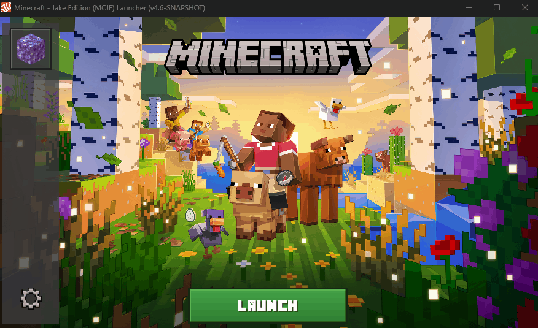

# MCJE Launcher



I love the SKCRAFT launcher. But, this is my own custom Minecraft Java Edition modpack launcher built on top of [SKCraft Launcher](https://github.com/SKCraft/Launcher). Dark Minecraft themed UI, bundles Java 21, and updates itself automatically.

## Project Structure

```
launcher/              Core library. Auth, downloads, game launching
launcher-fancy/        The actual UI people see. Dark theme, Substance L&F
launcher-bootstrap/    Tiny updater. Downloads and runs the latest launcher JAR
launcher-builder/      CLI for building modpack zips
creator-tools/         GUI for building modpacks (way easier than the CLI)
installer/             Windows and macOS installer scripts
```

## How it all fits together

```
Installer (ships Java 21 + bootstrap JAR)
  > Bootstrap grabs latest launcher from DigitalOcean Spaces
    > launcher-fancy.jar runs, shows modpack list
      > User hits play, Minecraft launches
```

On first run the bootstrap copies its bundled JRE into the launcher data folder. After that the launcher JAR updates itself, so you only need to rebuild the installer if you change the bootstrap or the bundled Java version.

## Building

You need JDK 8+ installed. Gradle wrapper is included, you don't need to install Gradle.

```bash
./gradlew build
```

JARs show up in `<module>/build/libs/`. They're all fat JARs (shadow plugin), so everything is bundled.

| Module | JAR | Main Class |
|--------|-----|------------|
| launcher | launcher.jar | com.skcraft.launcher.Launcher |
| launcher-fancy | launcher-fancy.jar | com.skcraft.launcher.FancyLauncher |
| launcher-bootstrap | launcher-bootstrap.jar | com.skcraft.launcher.Bootstrap |
| launcher-builder | launcher-builder.jar | com.skcraft.launcher.builder.PackageBuilder |
| creator-tools | creator-tools.jar | com.skcraft.launcher.creator.Creator |

## Running locally for testing

After building, you can run the launcher directly:

```bash
java -jar launcher-fancy/build/libs/launcher-fancy.jar --dir ./testdata
```

The `--dir` flag points to a directory for all launcher data (instances, libraries, config). Useful so you don't mess with your real install while testing. You can also pass `--portable` to keep everything in the current folder.

## Config files you care about

### `launcher/src/main/resources/com/skcraft/launcher/launcher.properties`

Where the launcher looks for modpacks, news, and updates. Also has the Microsoft OAuth client ID (registered in Azure AD, you don't need to set up your own).

```properties
newsUrl=https://mcje-bucket.sfo3.digitaloceanspaces.com/news.html?version=%s
packageListUrl=https://mcje-bucket.sfo3.digitaloceanspaces.com/packages.json?key=%s
selfUpdateUrl=https://mcje-bucket.sfo3.digitaloceanspaces.com/latest.json
microsoftClientId=d18bb4d8-a27f-4451-a87f-fe6de4436813
```

### `launcher-bootstrap/src/main/resources/com/skcraft/launcher/bootstrap.properties`

Where the bootstrap stores user data and where it checks for launcher updates.

```properties
homeFolderWindows=MCJE
homeFolderLinux=MCJE
homeFolder=.MCJE
launcherClass=com.skcraft.launcher.FancyLauncher
latestUrl=https://mcje-bucket.sfo3.digitaloceanspaces.com/latest.json
```

### Where user data lives

| Platform | Path |
|----------|------|
| Windows | `%LOCALAPPDATA%\MCJE` |
| macOS | `~/.MCJE` |
| Linux | `$XDG_DATA_HOME/MCJE` or `~/.local/share/MCJE` |

## Custom assets

The launcher uses custom images that live in the source tree. If you want to rebrand or swap them out:

| File | What it is |
|------|-----------|
| `launcher/src/main/resources/.../icon.png` | Main launcher window icon |
| `launcher/src/main/resources/.../instance_icon.png` | Default modpack icon |
| `launcher/src/main/resources/.../tray_ok.png` | System tray icon |
| `launcher-fancy/src/main/resources/.../mcje-background.png` | Launcher background image |
| `launcher-fancy/src/main/resources/.../launcher_bg.jpg` | Alternate background |
| `launcher-fancy/src/main/resources/.../icons/MCJE-Beyond-Depth-Plus-26.png` | Modpack icon |
| `launcher-fancy/src/main/resources/.../icons/options.png` | Settings gear icon |
| `installer/windows/resources/icon.ico` | Windows installer/shortcut icon |

Note: there is no `installer/macos/resources/icon.icns` yet. macOS installs will use a default icon until you add one. See `installer/README.md` for how to generate it from the PNG.

## Hosting your files

This project is currently set up to use a DigitalOcean Spaces bucket, but you can use anything that serves static files over HTTPS (AWS S3, Cloudflare R2, GitHub Pages, your own web server, whatever). The launcher doesn't care where the files live, it just hits the URLs in the config.

To switch to a different host, update the URLs in these two files and rebuild:

1. `launcher/src/main/resources/com/skcraft/launcher/launcher.properties` (newsUrl, packageListUrl, selfUpdateUrl)
2. `launcher-bootstrap/src/main/resources/com/skcraft/launcher/bootstrap.properties` (latestUrl)

Also update the `url` inside your `latest.json` to point to wherever you're hosting the launcher JAR.

### What needs to be hosted

Your host needs these files:

```
latest.json        Tells the bootstrap what version to download
launcher.jar       The launcher-fancy shadow JAR
packages.json      List of available modpacks
news.html          Shows up in the launcher news tab
[modpack files]    Whatever modpacks you've built
```

`latest.json` looks like this:

```json
{
  "version": "4.8",
  "url": "https://mcje-bucket.sfo3.digitaloceanspaces.com/launcher.jar"
}
```

`packages.json` looks like this:

```json
{
  "minimumVersion": 1,
  "packages": [
    {
      "name": "my-modpack",
      "title": "My Modpack",
      "version": "20250101",
      "location": "my-modpack.json",
      "priority": 1
    }
  ]
}
```

`name` is the internal ID, `title` is what shows in the launcher, `location` is the URL path to the modpack manifest (relative to your bucket), and `priority` controls sort order (higher = shows first).

`news.html` is just a plain HTML page. Keep it simple because Java's built in HTML renderer is terrible. Stick to basic text, headings, links, and lists. No fancy CSS or JavaScript.

## Pushing a launcher update to users

1. `./gradlew :launcher-fancy:build`
2. Upload `launcher-fancy/build/libs/launcher-fancy.jar` to the bucket as `launcher.jar`
3. Bump the version in `latest.json`
4. Done. Users pick it up next time they open the launcher

## Building modpacks

Use the GUI, it's way easier:

```bash
java -jar creator-tools/build/libs/creator-tools.jar
```

Or the CLI if you want:

```bash
java -jar launcher-builder/build/libs/launcher-builder.jar \
  --version "1.0" \
  --manifest-dest output/manifest.json \
  -input src/
```

Modpack folder layout:

```
src/
  config/
  mods/
  resourcepacks/
loaders/          Drop Forge/Fabric/LiteLoader installers here
```

## Portable mode

Drop an empty file called `portable.txt` next to the bootstrap JAR and the launcher will store everything in the current directory instead of AppData/home. Good for USB drives or keeping things self contained.

## Building installers

Full instructions in [installer/README.md](installer/README.md).

Short version:
- **Windows:** Need Inno Setup 6 installed. Run `installer/windows/build-installer.ps1` in PowerShell
- **macOS:** Run `installer/macos/build-installer.sh`

Both download Java 21, build the bootstrap, and spit out an installer.
- Windows: `dist/windows/MCJE-Launcher-Setup.exe`
- macOS: `dist/macos/MCJE-Launcher-Installer.dmg`

## When you inevitably forget how all this works

1. `./gradlew build` to make sure everything compiles
2. `launcher-fancy` = the launcher people actually use (dark Minecraft UI)
3. `launcher-bootstrap` = the thing the installer ships, it just downloads and runs launcher-fancy
4. All the URLs live in `launcher.properties` and `bootstrap.properties` (see above)
5. The Microsoft OAuth client ID is in `launcher.properties`, already registered in Azure AD
6. To push a launcher update: build launcher-fancy, upload JAR to bucket, bump `latest.json`
7. To push modpack changes: build with creator-tools, upload files, update `packages.json`
8. You only need to rebuild installers if the bootstrap code or Java version changes
9. Custom images are in the source tree (see Custom assets section), swap them to rebrand
10. No macOS .icns icon yet, add one to `installer/macos/resources/` if you build a Mac installer

## License

GNU Lesser General Public License, version 3. See [LICENSE.txt](LICENSE.txt).
